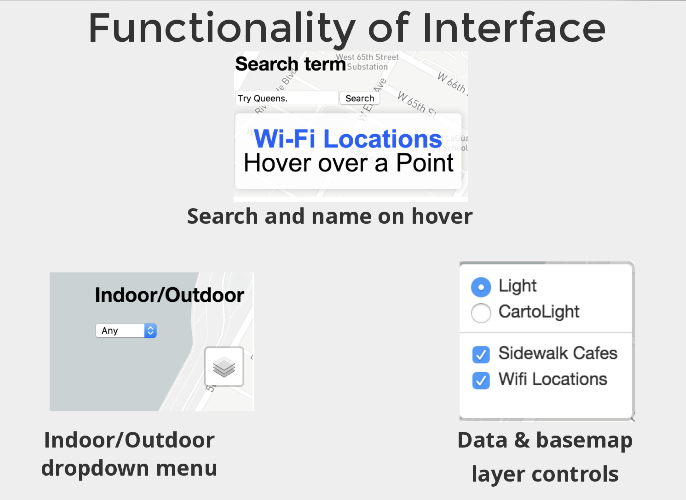
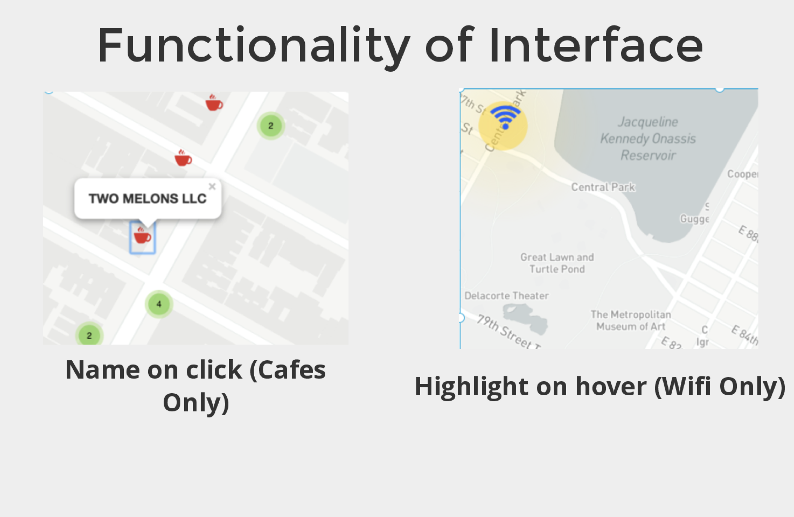

# wifi-map

* The goal of this application is to allow people to find free Wi-Fi locations with an added layer of convenience with  sidewalk café locations in proximity to them. This was a bootstrapped project to quickly deploy and develop within a 24 hour time frame using free and quickly avaiable tools and code. 

here is the demo of the map: https://ralaruri.github.io/wifi_map_js/

### Stack this map is built on:
* Front End: Using Leaflet.js and some Javascript
  * Leafet: https://leafletjs.com 
  
* Backend: Carto using a Postgres Database with PostGIS functions.
  * https://carto.com
  
#### Beauty of the Querying:
* SQL is nothing new but how it is used in this application is pretty creative:
* Using Cartos API to call the geojson of the queried dataset in order to visualize it in leaflet within the search box!

### Tooling:
* Jsbin: https://jsbin.com/?html,output
  * live programming using javascript, able to emulate a web browser extremely quick prototyping. 
  * no need to host code on a server
  * downside lacking SSL certification, within the meulation, impacts the usage of geolocation feature in MVP

### Data:
 * NYC Open Data: https://opendata.cityofnewyork.us
 * Utilized two seperate data sets and imported them as tables within Postgres Database
  * Side Walk Cafes Data Set
  * Outdoor Wifi Locations Data Set
 

### Interface:
* Indoor/Outdoor Drop Down Menu
* Data Toggle Switches (Sidewalk Cafes & Wifi Locations)
* Radio Button to switch between a low detail light base map & and a higher detail base map provided by Carto. 
* Hover over Points

### Disabled Features:
* Geolocation Feature:
  * If not located in NYC it would pin you at your current location. 
  * Need to add some sort of anonymization buffer also.

### Screen Shots:
#### Overview:

#### Interface 1:

#### Interface 2: 

